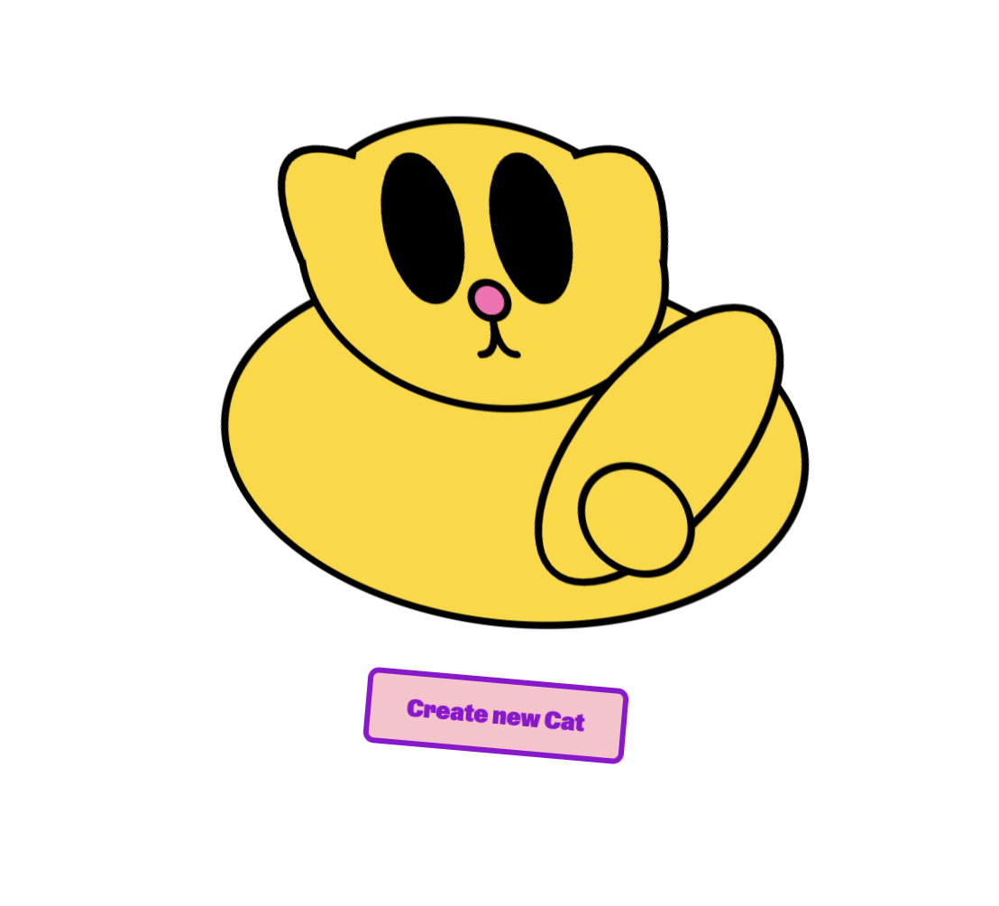

# Vector Cat Creator :robot:

## What is this?

This is a simple project to create a cat using a LLM. It uses the OpenAI API to generate a cat in SVG format. The cat is then displayed in a web component and animated using CSS – _just for fun and not optimized in any direction_.

## How to run

1. Clone the repository
2. Install dependencies using `bun install`
3. Run the project using `bun run`

## How to use

To create a new cat, simply click the button and wait for the AI to generate a cat.
